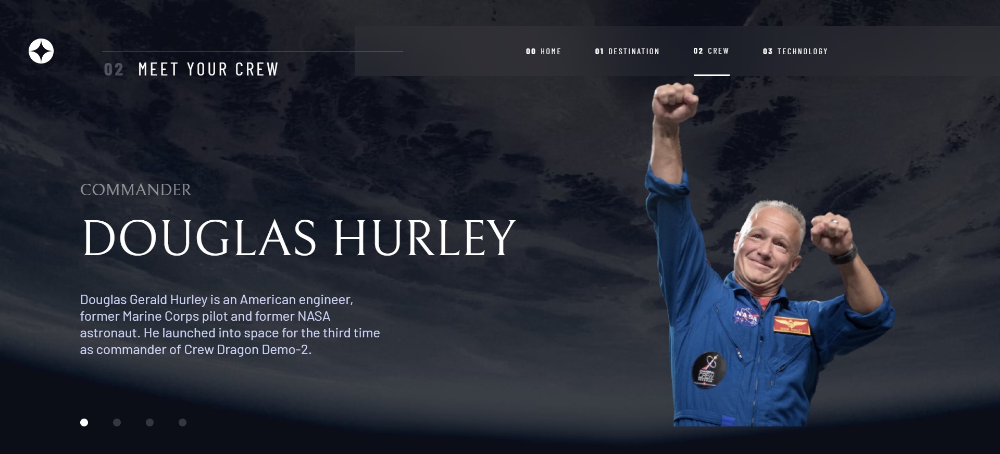

# Frontend Mentor - Space tourism website solution

This is a solution to the [Space tourism website challenge on Frontend Mentor](https://www.frontendmentor.io/challenges/space-tourism-multipage-website-gRWj1URZ3).

# Frontend Mentor - Solução do website Turismo espacial

Esta é a solução para o [Desafio website de Turismo espacial do Frontend Mentor](https://www.frontendmentor.io/challenges/space-tourism-multipage-website-gRWj1URZ3).

## Table of contents

- [Overview](#overview)
  - [The challenge](#the-challenge)
  - [Links](#links)
- [My process](#my-process)
  - [Built with](#built-with)
  - [What I learned](#what-i-learned)
  - [Continued development](#continued-development)
  - [Useful resources](#useful-resources)
- [Author](#author)
- [Acknowledgments](#acknowledgments)
- [Screenshot](#screenshot)
  -[Desktop](#desktop)
  -[Mobile](#Mobile)

## Índice

- [Visão geral](#visão-geral)
  - [O desafio](#the-challenge)
  - [Links](#links)
- [Meu processo](#my-process)
  - [Construído com](#built-with)
  - [O que aprendi](#what-i-learned)
  - [Desenvolvimento continuado](#continued-development)
  - [Recursos úteis](#useful-resources)
- [Autor](#author)
- [Reconhecimentos](#acknowledgments)
- [Fotos](#screenshot)
  -[Desktop](#desktop)
  -[Mobile](#Mobile)

**Note: Delete this note and update the table of contents based on what sections you keep.**

## Overview
## Visão Geral

### The challenge

Users should be able to:

- View the optimal layout for each of the website's pages depending on their device's screen size
- See hover states for all interactive elements on the page
- View each page and be able to toggle between the tabs to see new information

### O desafio

O usuário deverá ser capaz de:

- Visualizar o layout otimizado para cada página do website dependendo do tamnho da tela de seu dispositivo
- Visualizar os estados de hover para todos os elementos interativos da página
- Visualizar cada página e conseguir trocar as abas para ver novas informações

### Links

- Solution URL: [Solution](https://www.frontendmentor.io/solutions/space-tourismhtmlcssjs-vuejsbootstrapsassjsonrouter-VhcbNuw7-3)
- Live Site URL: [Live](https://arthurnassar.github.io/space-tourism/)

## My process
## O processo

### Built with

- HTML5
- CSS
- Javascript
- Flexbox
- CSS Grid
- [Bootstrap](https://getbootstrap.com/) - 
- [Sass](https://sass-lang.com) - CSS on Steroids
- [Vuejs](https://vuejs.org/) - JS Framework
- [Vue Router](https://router.vuejs.org/) - Vue library
- JSON data management
- Dynamic webpages

### Feito com

- HTML5
- CSS 
- Javascript
- Flexbox
- CSS Grid
- [Bootstrap](https://getbootstrap.com/) - 
- [Sass](https://sass-lang.com) - CSS buffado
- [Vuejs](https://vuejs.org/) - Framework JS 
- [Vue Router](https://router.vuejs.org/) - Livraria Vue
- Manuseio de dados em JSON
- Páginas Web dinâmicas

### What I learned

Use this section to recap over some of your major learnings while working through this project. Writing these out and providing code samples of areas you want to highlight is a great way to reinforce your own knowledge.

#### Skills

##### HTML
I've reinforced my basic skills of HTML and got a better understanding of the semantic tags

If you want more help with writing markdown, we'd recommend checking out [The Markdown Guide](https://www.markdownguide.org/) to learn more.

**Note: Delete this note and the content within this section and replace with your own learnings.**

### Continued development

Use this section to outline areas that you want to continue focusing on in future projects. These could be concepts you're still not completely comfortable with or techniques you found useful that you want to refine and perfect.

**Note: Delete this note and the content within this section and replace with your own plans for continued development.**

### Useful resources

- [Example resource 1](https://www.example.com) - This helped me for XYZ reason. I really liked this pattern and will use it going forward.
- [Example resource 2](https://www.example.com) - This is an amazing article which helped me finally understand XYZ. I'd recommend it to anyone still learning this concept.

**Note: Delete this note and replace the list above with resources that helped you during the challenge. These could come in handy for anyone viewing your solution or for yourself when you look back on this project in the future.**

## Author

- Website - [Add your name here](https://www.your-site.com)
- Frontend Mentor - [@yourusername](https://www.frontendmentor.io/profile/yourusername)
- Twitter - [@yourusername](https://www.twitter.com/yourusername)

**Note: Delete this note and add/remove/edit lines above based on what links you'd like to share.**

## Acknowledgments

This is where you can give a hat tip to anyone who helped you out on this project. Perhaps you worked in a team or got some inspiration from someone else's solution. This is the perfect place to give them some credit.

**Note: Delete this note and edit this section's content as necessary. If you completed this challenge by yourself, feel free to delete this section entirely.**

## Screenshot

### Desktop

### Mobile

